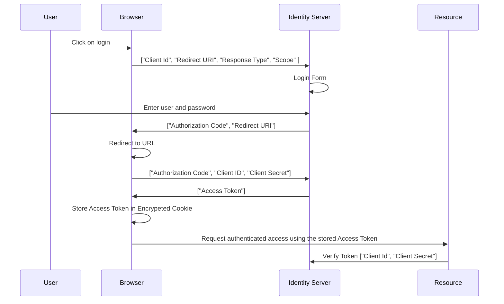

**Run locally using docker**

`docker compose up -d`

## Technologies used

- [NET Core 8]()
- [Entity Framework]()
- [Docker]()
- [PostgresDb]()
- [MongoDb]()
- [Masss Transit]()
- [Rabbit MQ]()
- [Identity Server](https://docs.duendesoftware.com/identityserver/v7) JWT token
- [Microsoft YARP](https://microsoft.github.io/reverse-proxy/) Reverse Proxy as Gateway Service so it provides a single endpoint for all services. Security as part of the request, URL rewriting. Load balancing and caching.

## Test

### Unit Tests

**Unit test should test one thing**

[Unit test controller logic in ASP.NET Core](https://learn.microsoft.com/en-us/aspnet/core/mvc/controllers/testing?view=aspnetcore-8.0)

- Fast, test should complete quickly, (think milliseconds rather than second).
- Isolated, no dependency of execution order.
- Repeatable, should be able to run over and over with the same result.
- Self-Checking, no human interaction.
- Timely, should not take longer to write the test than it took to write the code.

Naming convention of unit tests:
`MethodToTest_Scenario_ExpectedResult`

For our unit tests we will use:

- [XUnit](https://xunit.net/)
- [Moq](https://github.com/devlooped/moq/wiki)
  - [Video](https://learn.microsoft.com/en-us/shows/visual-studio-toolbox/unit-testing-moq-framework)
- [AutoFixture](https://github.com/AutoFixture/AutoFixture?tab=readme-ov-file#documentation)

### Automated Integration Test

Automated integration tests should test how separate part of application work together, without the need of external services like databases.
[Integration tests in ASP.NET Core](https://learn.microsoft.com/en-us/aspnet/core/test/integration-tests?view=aspnetcore-8.0)

We use test doubles instead of the real services, as our services still dependent on these external services. We need to control the behaviour of this dependencies by using any of the following:

- Fake, has working implementation. For example a in memory database.
- Mock, has a mock implementation that is programmed to return specific behaviour.
- Stub, just return a predefined value.

For our integration tests we will use:

- [XUnit](https://xunit.net/)
  - [XUnit's IAsyncLifetime](https://www.danclarke.com/cleaner-tests-with-iasynclifetime)
- [Moq](https://github.com/devlooped/moq/wiki)
  - [Video](https://learn.microsoft.com/en-us/shows/visual-studio-toolbox/unit-testing-moq-framework)
- [AutoFixture](https://github.com/AutoFixture/AutoFixture?tab=readme-ov-file#documentation)
- [MassTransit Test Harness](https://masstransit.io/documentation/concepts/testing)
- [Test Containers](https://www.azureblue.io/asp-net-core-integration-tests-with-test-containers-and-postgres/)

## Client

### Next.JS

Next.js is an open-source web development framework created by the private company Vercel providing React-based web applications with server-side rendering and static website generation.

[Documentation](https://nextjs.org/docs)

#### Why Next.JS?

**Pro**

- Performance.
- Lazy loading and pre-fetching.
- Good SEO due to server side rendering.
- BFF, [Backend for Frontend Design Pattern with Next.js](https://dev.to/adelhamad/bff-backend-for-frontend-design-pattern-with-nextjs-3od0).
- Secure, can keep secrets in the back end, never exposed to client.
- React based.

**Cons**

- Opiniated, can frustrate some.
- Routing, some dont like the way its implemented.
- React based.

## Tailwind

- [flex](https://flexboxfroggy.com/)
- npm install react-icons
- npm install react-countdown
- [Flowbite React](https://www.flowbite-react.com/)
  - `npm install flowbite flowbite-react`

## Helpres

- [query-string](https://github.com/sindresorhus/query-string#readme) Assist in forming the query string parameters for the search requests.

## State Management

Instead of storing state locally in each component we will use [Zustand](https://docs.pmnd.rs/zustand/getting-started/introduction) as a lightweight state management solution.

## Authorization

[NextAuth](https://next-auth.js.org/) will become [Auth.js](https://authjs.dev/).

`npm install next-auth`

## CRUD with Forms

